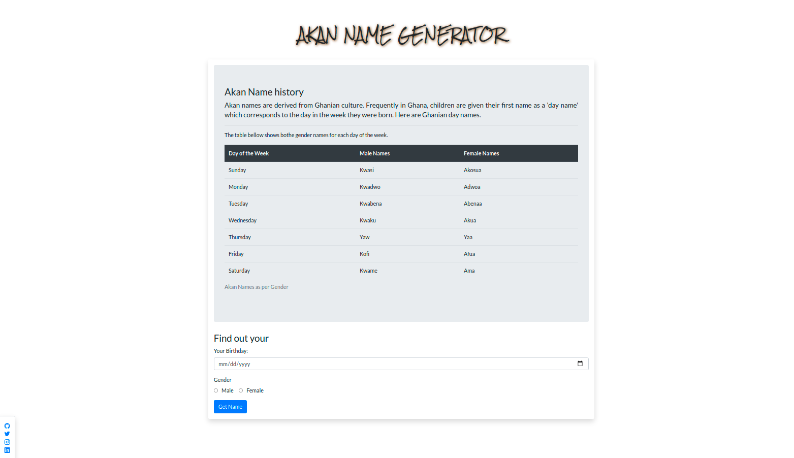

# Akan-Names

## Author

[Kinoti Gitonga]

## Description

This project is a web application that takes a user's birthday and calculates the day of the week they were born and then depending on their gender outputs their Akan Name. 

## Screenshot


## Live Page 
 


## Installation / Setup instruction
* Open Terminal

* Navigate to desired directory

* git clone ```https://github.com/ikinoti/Akan-Name-Generator```

* cd to the cloned directory

* code . or atom . based on the text editor you have.

## Technologies Used

* HTML
* CSS
* Bootstrap
* JavaScript


## BDD

* Compute the day of the week from form inout information

* Based on the Gender checked output akan name from array of that gender

## Known Bugs
* Some output are not as accurate as expected..

## Contact Information 

If you have any question or contributions, please email me at [isaiah.gitonga@student.moringaschool.com]

## License
* *MIT License:*
* Copyright (c) 2019 **Kinoti Gitonga**